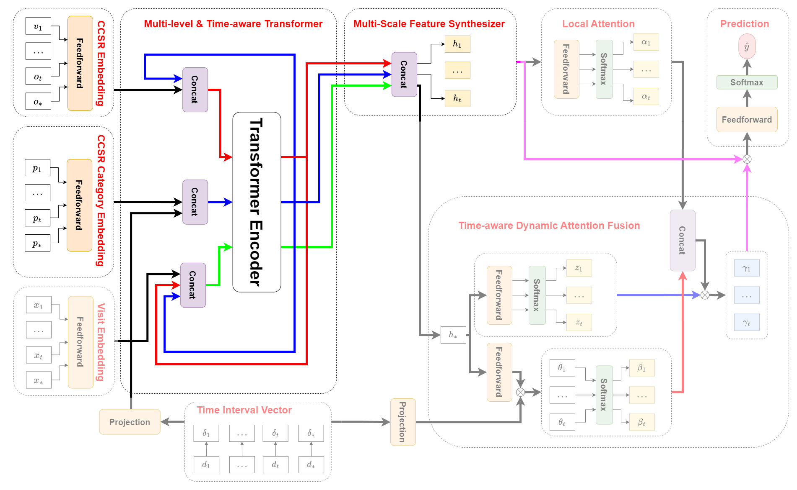

# Multi-scale and Multi-level Attention based on External knowledge in EHRs

## 16th Asian Conference on Intelligent Information and Database Systems (ACIIDS2024)

### Introduction

This paper proposes a multi-level, multi-scale attention model based on external knowledge. The model reasonably mimicked the prediction process of doctors by exploiting general to detailed correlations in the input data.git


#### Requirements

This code built with the following libraries

- Python 3.8 or higher
- Pytorch 1.8 or higher
- Transformers
- tqdm
- CUDA 10.0 or higher
- Scikit-Learn
- datasets
- swifter
- pandas

Installation

```
!git clone https://github.com/Haru-Lab-Space/ACIIDS-2024.git
cd ACIIDS-2024
!pip install -r requirements
```

### Method



- Multi-level & Time-aware Transformer: We perform multi-level attention prediction based on three main code groups: CCSR body systems, CCSR category codes and ICD-10.
- Multi-scale Feature Synthesizer: After passing through the Transformer encoder, the outputs corresponding to each code group will be aggregated along with the timestamp to form a single block.

### Result

The Accuracy@15 of Diagnosis Prediction Task.

| Model      	| precision macro avg	| recall macro avg	| f1-score macro avg	| precision weighted avg   	| recall weighted avg	| f1-score weighted avg	|
|-------	|-----------	|--------	|----------	|--------------	|--------	|----------	|
| RNN         |33.6776   | 28.7552  | 28.7417 | 41.0856 | 46.8880 | 41.6769|
| GRU         |33.2303   | 29.3872  | 28.9467 | 41.4116 | 47.5727 | 42.2985|
| LSTM        |32.7248   | 28.3776  | 28.0900 | 40.7329 | 46.9140 | 41.4706|
| Dipole      |32.4271   | 29.4675  | 28.7185 | 41.3474 | 47.9466 | 42.4984|
| HiTANet     |32.9247   | 32.2820  | 30.6096 | 42.9891 | 48.5730 | 44.0498|
| MsTA        |36.2908   | 32.8971  | 32.7226 | 44.6763 | 49.7170 | 45.5842|

Performance of the ablation study model in test set.

| Model      	| precision macro avg	| recall macro avg	| f1-score macro avg	| precision weighted avg   	| recall weighted avg	| f1-score weighted avg	|
|-------	|-----------	|--------	|----------	|--------------	|--------	|----------	|
| MsTA-R      |33.4163 | 31.8170 | 30.6259 | 42.9507 | 48.8467 | 44.2205|
| MsTA-CR     |36.3424 | 31.4322 | 31.5611 | 44.3587 | 49.1252 | 44.8056|
| MsTA        |36.2908   | 32.8971  | 32.7226 | 44.6763 | 49.7170 | 45.5842|

### Explaination

An example of the explanatory capability of the proposed model. It provides us with specifics on how the model's outcome is achieved through allocating attention weights. The utilization of CCSR category codes has significantly narrowed the aspects that the model needs to focus on.

|Visit              |1        |2        |3       |4        |5        |6        |
|-------	          |---------|--------	|------- |---------|---------|---------|
|Overall Attention  | 0.0857  | 0.1971  |0.1262  | 0.2433  | 0.2577  |         |
|Global Attention   | 0.0107  | 0.0158  | 0.0161 | 0.0165  | 0.0237  |         |
|Local Attention    | 0.0862  | 0.1983  | 0.1269 | 0.2447  | 0.2592  |         |
|CCSR Category Code | EXT     | GEN     | SKN    | EXT     | CIR     | MBD     |
|                   | FAC     | MBD     | MBD    | GEN     | EXT     | SYM     |
|                   | MBD     |         |        | MBD     | GEN     |         | 
|                   |         |         |        | SYM     | MBD     |         |
|                   |         |         |        |         | SYM     |         |
|ICD-10 Code        | Y831    | N400    | F4310  | Y838    | R079    | F329    |
|                   | Z23     | F329    | F17210 |N400     | Y929    | F419    |
|                   |  Z720   | F419    |  L03116| F329    | N401    | F4310   |
|                   | F329    | F4310   |        | F419    | F329    | F17210  |
|                   | F4310   | F17210  |        | F4310   | F419    | G8929   |
|                   |         |         |        |  F17210 | F4310   |         |
|                   |         |         |        | G8929   | F17210  |         |  
|                   |         |         |        |         | G8929   |         |  
|                   |         |         |        |         | R338    |         |  


### Pretrained weight of our model.
Link: [MsTA weight](/checkpoint/model.pt)
